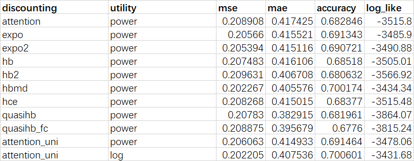

I propose a new model of intermporal choice, drawing on the recent
literature on rational inattention. I assume the decision makers seek to
maximize the weighted sum of instantaneous utilities, where the weights
depend on the attention assigned to each time point. The initial
attention allocation is in line with time-consistent choice. But after
knowing the temporal reward structure, they tend to assign more weights
(pay more attention) to the time points with larger rewards, though the
attention-adjusting process incurs a cognitive cost. I show that this
process can explain a lot of behavioral biases, including common
difference effect, magnitude effect, risk aversion over time lotteries,
interval additivity anomalies, intertemporal correlation aversion, and
inconsistent planning. Also, several discounting models can be viewed as
a special case of this model, such as magnitude-dependent hyperbolic
discounting and quasi-hyperbolic discounting.

# Introduction

Suppose a decision maker is informed that she will receive a sequence of
rewards $\textbf{x}=[x_0,x_1,...,x_T]$. Her instantaneous utility in
time point $t$ is $u(x_t)$, which is twice differentiable and strictly
increasing in $x_t$, and $u(0)=0$. I assume that she values the reward
in each time point separately, then use the weighted sum of each
instantaneous utility to represent the overall utility of her own $U$.
Thus,$$
U(\textbf{w};\textbf{x}) = \sum_{t=0}^T w_t u(x_t)
$$where $\textbf{w} = [w_0,w_1,...,w_T]'$ denotes decision weights,
$w_i \geq 0$ for all $i\in \{1,..,T\}$ and $\sum_{t=0}^T w_t = 1$.

The idea that decision makers evaluate an option using the sum of
weighted utilities is widely adopted in behavioral economic literature.
[^1] In intertemporal choice setting, those weights (aka $\textbf{w}$)
is decided by some discounting function. According to the classical work
of @strotz_myopia_1955, when the decision maker is time-consistent,
$\textbf{w}$ should take an exponential form. We assume
$\textbf{w} =\{1/\iota,\delta/\iota,\delta^2/\iota,...,\delta^T/\iota\}$
under this circumstance, where $\delta$ is a constant parameter and
$\iota =\sum_{t=0}^T \delta^t$.

[^1]: For example, in risky choice theories, such as prospect theory,
    the weights are interpreted as the outputs of probability weighting
    function.

I use a simple example to illustrate how the model works. Suppose the
decision maker is asked to choose one option between "receive $x^s$ now"
and "receive $x^l$ in $T$", where $0<x^s<x^l$, $T>0$. By choosing to
receive $x^s$ now, the decision maker can obtain utility $u(x^s)$ at
time point $0$. By choosing to receive $x^l$ later, she can gain
$u(x^l)$ at time point $T$ and $0$ at other time points; thus, her
overall utility is $w_Tu(x^l)$.

I assume the decision maker is initially time-consistent, and for
simplicity, the discounting parameter $\delta = 1$. So, when considering
the "receiving later" option, her initial decision weight allocation is
$\textbf{w}^0 = [1/T,1/T,...,1/T]$. She can reallocate the weights to
$\textbf{w}$, in order to maximize $w_T u(x^l)$; but the reallocation
process triggers some cognitive cost, which also needs to be considered
in utility maximization. When the cost is zero, she will assign full
weight to time point $T$ and zero weight to other time points; when the
cost is fairly large, $\textbf{w}$ cannot deviate from $\textbf{w}^0$ by
too much. I define the cognitive cost function with KL divergence, a
measure of how much a distribution differs from another. Therefore, the
decision maker's objective is $$
\max_{\textbf{w}} \; U(\textbf{w};\textbf{x})-\lambda\cdot D_{KL}(\textbf{w}||\textbf{w}^0)
$$ where $\lambda$ is a parameter, and the definition of
$D_{KL}(\textbf{w}||\textbf{w}^0)$ is$$
D_{KL}(\textbf{w}||\textbf{w}^0)= \sum_{t=0}^T w_i \log(\frac{w_i}{w_i^0})
$$

The FOC condition of this optimization problem tells us
$w_t \propto \delta^t \exp\{u(x_t)/\lambda\}$. Therefore, when
considering "receive $x^l$ in $T$", the decision maker will adjust her
weight for time point $T$ to $$
w_T = \frac{1}{1+k\cdot T}
$$where $k=e^{-u(x^l)/\lambda}$. Clearly, $w_T$ takes a similar form
with hyperbolic discounting function. The literature on rational
inattention [@matejka_rational_2015; @jung_discrete_2019;
@mackowiak_rational_2023] suggests that the determination of $w_T$ can
be interpreted as some costly top-down attention shifting process.
Therefore, I term the weights calculated by such decision process as
"*attention-adjusted discounting factors*".

Let us set $T = 9$, $x^s = 12$, $x^l = 16$, $u(x) = \lambda x^{0.5}$. I
show that how the attention-adjusted discounting factor $w_T$ satisfies
both the magnitude effect and the common difference effect. First, if
the decision maker chooses to receive $x^s$ now, she gains
$u(x^s) = 3.46\lambda$; if she chooses to receive $x^l$ in $T$, she
gains $w_Tu(x_l) = 4\lambda/(1+9e^{-4})=3.43\lambda$. Hence, in this
setting she tends to receive $x_s$ now. Second, for magnitude effect, we
can increase $x^s$ and $x^l$ by a same amount, say $9$. Then the utility
of receiving reward earlier will be $4.58\lambda$, and that of receiving
later will be $4.71\lambda$, i.e. increasing the reward magnitude by a
same amount makes her more likely to wait. Finally, for common
difference effect, we can delay the reward of each option by a same
interval, say $3$. Then the utility of receiving reward earlier shrinks
to $u(x^s)/(1+3e^{-u(x^s)/\lambda})=3.17\lambda$ and that of receiving
later shrinks to $3.28\lambda$, i.e. adding a common delay to each
option makes her more likely to wait.

# The Model

## Attention Reallocation Process

Consider a decision maker evaluating a sequence of rewards, which
depends on the state of world $s$. The time length of this sequence is
$T$. Let $t$ denote each time point, $t\in [0,T]$. The decision maker
samples from those time points and aggregate the utilities she can
obtain in each time point in her sample, to construct a value
representation of $s$. Her objective is to find a sampling strategy
$f(t,s)$, which denotes the choice probability for each time point under
each certain state. I set the probability of $s$ occurring and the
unconditional probability of choosing $t$ to be $p(s)$, $p(t)$ . By the
insight of motivated beliefs, I assume she wants to maximize her total
utility through $f$; thus, time points with greater rewards should be
sampled more frequently. However, processing reward information is
costly. Following the rational inattention literature, the optimization
problem for the decision maker is $$
\begin{split}
& \max_f\; \int u(t,s)f(t,s)dtds - \lambda I(t;s) \\
& s.t. \; \int u(t,s)dt = p(s),\, \forall s
\end{split}
$$ where $\lambda$ is a fixed parameter and $I(t;s)$ denotes Shannon
mutual information. $$
I(t;s)=E_s[D_{KL}(f(t,s)||p(t))]=
\int f(t,s) \log\left(\frac{f(t,s)}{p(t)p(s)}\right)dtds
$$ The solution is $$
f(t|s) =\frac{p(t)e^{u(t,s)/\lambda}}{\int_z p(z) e^{u(z,s)/\lambda}}
$$

The authors of rational inattention map this to a discrete choice
setting. I also consider discrete time here: $t \in\{0,1,...,T\}$.
Therefore, the process can be viewed as the decision maker use a
weighted sampling strategy to evaluate a time sequence that is evenly
split into multiple periods and rewards arrive at the beginning of each
period. The initial decision weights for each time period
$w_t^0 \equiv p(t)$, and after processing the information, she adjusts
the weights to $w_t \equiv f(t|s)$.

When facing a intertemporal choice, the decision maker evaluate each
option by: (1) bracketing the time horizon; (2) processing the
information about rewards within the horizon; (3) reallocating the
decision weights to each period within the horizon, with an optimal
sampling strategy. Then, she compare the options and make the choice. A
lot of literature has documented that human make decisions by sampling
approach.

For why I use Shannon mutual information here, one can refer to
@caplin_rationally_2022.

Posterior Separable

Changes in prior do not affect the selection of learning policy - in
descriptive intertemporal choice problem, the decision maker clearly
know she will receive what reward in what time, so the probability of
learning such specific payoff information is 1.

Only the payoff of each action (but not the labeling of action) will
affect action policy - that is, for the early time periods with payoff
0, we can either treat them as $T$ inidividual periods or an integrated
period with length $T$.

There are two experimental paradigms: SS vs LL, time budget. In the
former, the participants are informed when and how many rewards will
arrive, which is certain. In the latter, the participants decide the
timing and volume of rewards by themselves, which can be variable; thus,
I set that for $t>0$, $u_t = v(x_t) + \epsilon_t$,
$\epsilon_t \sim N(0,\lambda\sigma_t)$.

Throughout the paper, I assume $w_t^0 = \delta^t$, where $\delta$ is the
exponential discounting parameter, $\delta \in (0,1]$

## SS or LL

Given that the reward is pre-determined, the state $s$ is certain (or
$\sigma_t =0$).

Reward arrives only at period $T$. For all $t<T$, $x_t=0$.

The optimal weight for $T$ is $$
w_T = \frac{1}{1+G(T)\cdot e^{-v(x_T)/\lambda}}
$$ where $$
G(T) = \left\{\begin{split}
& T &, \delta=1\\
& \frac{1}{1-\delta}(\delta^{-T}-1) &,0<\delta<1
\end{split}\right.
$$

# Related Literature

One of the closest papers to this model may be @steiner_rational_2017.
@steiner_rational_2017 mainly consider a decision maker allocating
attention across discrete options and updating the attention allocation
over time. In each time point, given that the decision maker's ability
to process new information is limited, her attention allocation cannot
deviate from the original one in the last time point by too much. This
causes her action strategy to lag behind the state of world and to
perform a inertial style. However, the attention-adjusted discounting
model assumes the decision maker directly allocates attention across
discrete time points and evaluates each action separately. This makes it
convenient to analyze not only how decision makers will update action
strategy in a dynamic process, but also how their will choose between a
early small reward or a late large reward when these options are
presented in a descriptive form.

Another relevant model is proposed by @noor_optimal_2022 and
@noor_constrained_2020, which they term as "*costly empathy*". They
admits a similar intertemporal choice process, in which discounting
factors are determined by maximizing the sum of the utilities for each
time point, where the utility for each time point is the discounted
instantaneous utility of reward minus the cognitive cost of assigning a
non-zero discounting factor to a future time point. They prove that when
the margnial cognitive cost is increasing with both the discounting
factor and time, the final discounting factors will be increasing in
reward magnitude. My work differ from them by imposing a normalization
condition on the weights and presume a initial weight allocation.

@gershman_rationally_2020 propose another approach of applying rational
inattention into time discounting models. They assume that the decision
maker is uncertain about a future reward and runs a Bayesian estimation
on it. The discounting factor is decided by minimizing the distance
between the estimate and the true value of reward. They show under a
certain specification of rate-distortion function[^2], the discounting
factor for $T$ in SS vs LL task is $d_T = 1/(1+kT)$ given
$k=(\beta v_T)^{-1}$, where $\beta$ is a parameter and $v_T$ denote the
utility of reward obtained in $T$. Hereafter I call their model
"*magnitude-dependent hyperbolic discounting*". The attention-adjusted
discounting model with a logarithmic utility function and $\delta=1$ is
identical to the magnitude-dependent discounting with a power utility
function.

[^2]: $R = \frac{1}{2}\ln(\beta u_T/T+1)$

    where $u_T$ is the utility obtained by receiving reward in time
    point $T$.

My work may be helpful in understanding why the *Transformer* is so
powerful in building artificial intelligence.

# Behavioral Implications

## Common Difference Effect

The decision-maker prefers a small reward arriving at $t_1$, than a
large reward arriving at $t_2$ ($t_2>t_1$)

However, when the same large reward arrives at $t_2+\Delta t$ and the
same small reward arrives at $t_1+\Delta t$, the preference is reversed
($\Delta t>0$)

Suppose the two options (A and B) delivers the equal utility to the
decision-maker: *A. receive* $x_1$ in period $t_1$; B. receive $x_2$ in
period $t_2$.

For simplicity, we define $v\equiv v(x_1)/\lambda$ and
$\alpha\equiv v(x_2)/v(x_1)=w_{t_1}/w_{t_2}$

Note $t_2>t_1$, thus we have $x_1<x_2$, that is $\alpha>1$

If common difference effect holds, then there exists $\Delta t$ such
that $w_{t_1+\Delta t}/w_{t_2+\Delta t}<\alpha$

***Proposition 1: decision makers with attention-adjusted discounting
perform common difference effect***

## Magnitude Effect

People are getting more patient when increasing both the small and large
rewards by the same magnitude.

Noor & Takeoka (2022) provides another account, also based on finding
the optimal discounting factors. Attention-adjusted discounting model
admits a *General Costly Empathy (CE)* representation in their paper,
but its cognitive cost function is different. In their paper, for
discounting factor $d_t$, there exists
$0<\underline{d}_t<\overline{d}_t<1$ such that ***CE*** cognitive cost
is 0 when $d_t \in (0,\underline{d}_t]$, is strictly increasing when
$d_t\in (\underline{d}_t,\overline{d}_t]$, and is $\infty$ when
$d_t \in (\overline{d}_t,1]$

Define $V(t,x_t)=w_t(x_t)\cdot v(x_t)$. Again, assume $$
V(t_1,x_1)=V(t_2,x_2)\equiv 1+b 
\tag{2}
$$Given $t_1$, $t_2$, we can set $x_1$ that satisfies **eq. (2)** as a
function of $x_2$.

By definition, magnitude effect is $$
\frac{\partial }{\partial x_2}(\frac{x_1}{x_2})>0
\Longrightarrow 
\frac{\partial x_1}{\partial V}\frac{\partial V}{\partial x_2}x_2 -x_1>0
\Longrightarrow
\frac{\partial V}{\partial x_2}x_2>\frac{\partial V}{\partial x_1}x_1
$$

***Proposition 2: decision makers with attention-adjusted discounting
perform magnitude effect if*** $$
RRA_v - b\frac{\partial E_{vx}}{\partial v} <1
$$ ***where RRA is relative risk aversion coefficient of function***
$v(x)$, and $E_{vx} = v'(x)\frac{x}{v(x)}$ is the elasticity of $v$ to
$x$.

**Corollary 1: If** $v(x)$ admits a CRRA representation, then the
decision maker perform magnitude effect when CRRA\<1.

## **Risk Aversion over Time Lotteries**

Generally, people prefer a reward arriving at a sure time $t_M$, rather
than the same reward arriving at $t_S$ with probability $p$ and at $t_L$
with probability $1-p$, where $t_M = t_S \cdot p + t_L \cdot (1-p)$.

When short delay $p$ is smaller, the time lottery option is more
attractive compared with the sure time option.

A decision-maker is risk averse over time lotteries if and only if $$
V(t_M,x)\geq V(t_S,x)\cdot p +V(t_L,x) \cdot (1-p)
$$ which implies $\frac{\partial^2 V}{\partial t^2} \leq 0$

It can be derived that: $$
t \leq \ln \left(\frac{1-z}{z}\right)/\ln(\frac{1}{\delta}) \tag{3}
$$ where $\delta \in (0,1)$ and
$z\equiv 1/(1-\delta) \cdot e^{-v(x)/\lambda} \in (0,\frac{1}{2})$

**People are timing risk averse when delay is short, and are timing risk
seeking when delay is long.**

**When** $z$ gets smaller (or $x$ gets larger), the bound for $t$ gets
relaxed.

## Interval Additivity Anomalies

Super-additivity:

$V(t,x-\Delta x)\leq V(t+\tau,x)$

however, $V(t,x-2\Delta x) \geq V(t+2\tau,x)$

Sub-additivity:

$V(t-\tau,x)\geq V(t,x+\Delta x)$

however, $V(t-2\tau,x) \leq V(t,x+2\Delta x)$

Let $h$ denote the difference of rewards that satisfies
$V(t,x-h)=V(t+\tau,x)$ and is a function of $\tau$

Supper-additivity implies that when increasing $\tau$ by a certain
ratio, $h$ needs increasing by a larger ratio to make the equation hold.
$$
\frac{\partial^2 h}{\partial \tau^2}>0 
\Longrightarrow 
\frac{\partial^2 V}{\partial \tau^2} /\frac{\partial V}{\partial h}>0
\Longrightarrow
\frac{\partial^2 V}{\partial \tau^2} < 0
$$ From **ineq. (3)** we know that ***people perform super-additivity
when*** $t$ is small. When $x$ is larger, people are more likely to
perform super-additivity.

Similarly, people perform sub-additivity when $t$ is large. When $x$ is
smaller, people are more likely to perform super-additivity.

## Intertemporal Correlation Aversion

@andersen_multiattribute_2018

## Inconsistent Planning

Suppose the decision maker has a total reward $m$ and needs to allocate
it over $T$ periods. $$
x_0+x_1+...+x_T=m
$$ The decision maker optimally set $x_1$ at time period 0. Planning
fallacy implies that at time period 1 she tends to increase $x_1$. To
make her performs planning fallacy, we need to introduce uncertainty.
Without uncertainty, the decision maker with attention-adjusted
discounting factors is always time consistent.

At time period $i$, the optimal decision weights are $$
\textbf{w} = \arg \max_{\textbf{w}}\,\left\{\sum_{t=i}^TE_s[w_tu_t]-\lambda I(t;s)\right\}
$$

For example, the classical $(\beta,\delta)$-preference admits such a
representation:\
$$
\rho = \left\{\begin{split}
&\beta,\;t=0\\
& 1,\;t>0
\end{split}\right.
$$ where $\beta\in(0,1)$.

*Case 1:* $\sigma_t=0$ when $t=0$, and $\sigma_t=\sigma$ ($\sigma>0$)
when $t>0$.

This case is identical to $(\beta,\delta)$-preference.

*Case 2:* $\sigma_t = t\cdot\sigma$

The decision maker performs future bias.

(proof by contradiction)

# Empirical Test

I compare the following models in the dataset of
@marzilli_ericson_money_2015.

Using a similar method with @wulff_modeling_2018.

## 
